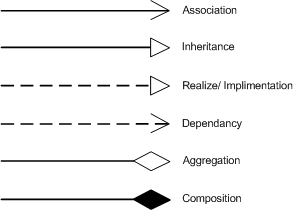

# Class Diagrams (p. 114)

Static structure of an object-oriented program containing
- attributes
- constructors
- methods
- relationships among classes and objects

May be 
- created as a design or analysis doc before coding
- generated from existing source code

## Relationships Between Classes

Two groups:
1. class-level relationships
   - inheritance
   - implementation
2. instance-level relationships
   - dependencies
   - association
   - aggregation
   - composition

### Class-Level Relationship
Inheritance is also called generalization because the subclass/type is a specialized form of the superclass/type.
The implementation relationship between a class and an interface means the class *implements* the interface.

### Instance-Level Relationship

- Dependency
   - points from the client element to the server element
   - changes to the server may cause changes to the client
 - Association
   - family of links
     - bi-directional (line)
     - uni-directional (directed line)
     - aggregation (includes composition aggregation)
     - reflexive (on the same class)
   - Can include:
     - role names
     - ownership indicators
     - [multiplicity](#multiplicity-notations)
     - visibility
     - etc.
 - Aggregation
   - specific binary association representing a part-whole or part-of relationship
   - contained class does **not** have a strong lifecycle dependency on container
     - a teacher **has** students
     - destroying a teacher doesn't mean destroying students
 - Composition
   - aka composition aggregation
   - stronger form of aggregation
   - considered as a "physical containment" relationship
   - when container is destroyed, contents are destroyed

#### Multiplicity Notations
| Notation  |          Meaning          |
| :-------: | :-----------------------: |
|     0     |       No instances        |
|   0..1    | No instance or 1 instance |
| 1 or 1..1 |    Exactly 1 instance     |
| 0..* or * |  Zero or more instances   |
|   1..*    |    1 or more instances    |

