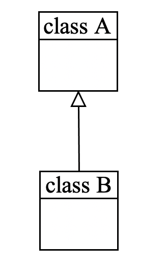
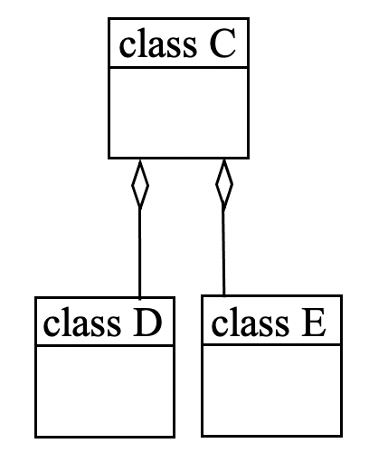

# Quiz 4: Class Diagrams

### 1. The relationship between class A and class B in the given class diagram is:
   

  - Inheritance
  - Association
  - Aggregation
  - Dependency

> **Correct answer**: Inheritance
>
> ---
> 
> **Explanation:**
> 
> Recall the [instance-level relationship notation.](../5/5.1.md#instance-level-relationship)

### 3. The relationship between class C and classes D/E in the given class diagram is:
   

  - Inheritance
  - Association
  - Aggregation
  - Dependency

> **Correct answer**: Aggregation
>
> ---
> 
> **Explanation:**
> 
> Recall the [instance-level relationship notation.](../5/5.1.md#instance-level-relationship)

### 4. Which of the following is not a type of association relationship in class diagrams?

  - Inheritance
  - Aggregation
  - Composition
  - Bi-directional association
  - Uni-directional association

  > **Correct answer**: Inheritance
  >
  > ---
  > 
  > **Explanation:**
  > 
  > Inheritance is a *class-level* relationship while association is an *instance-level* relationship.
  > - All other options are *types* of association.
  > 
  > Information on specific types and examples of instance-level relationships can be found in [Section 5.1.](../5/5.1.md#instance-level-relationship)
